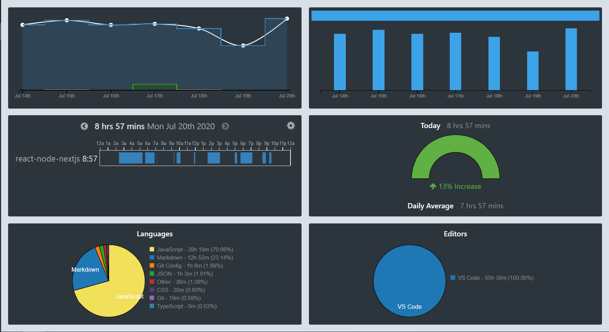

# WAKA-TIME REPORTS

## Introduction

[Waka Time](https://github.com/wakatime) is a Dashboards for developers, powered by open source IDE plugins.

## Installing

[x] Search and install "WakaTime" from extensions marketplace.

[x] Need install the extension Markdown Preview Enhanced to view in the VSCode.

## Timeline

### Update 20/07/2019 by [viethq](https://github.com/hevitq/)

